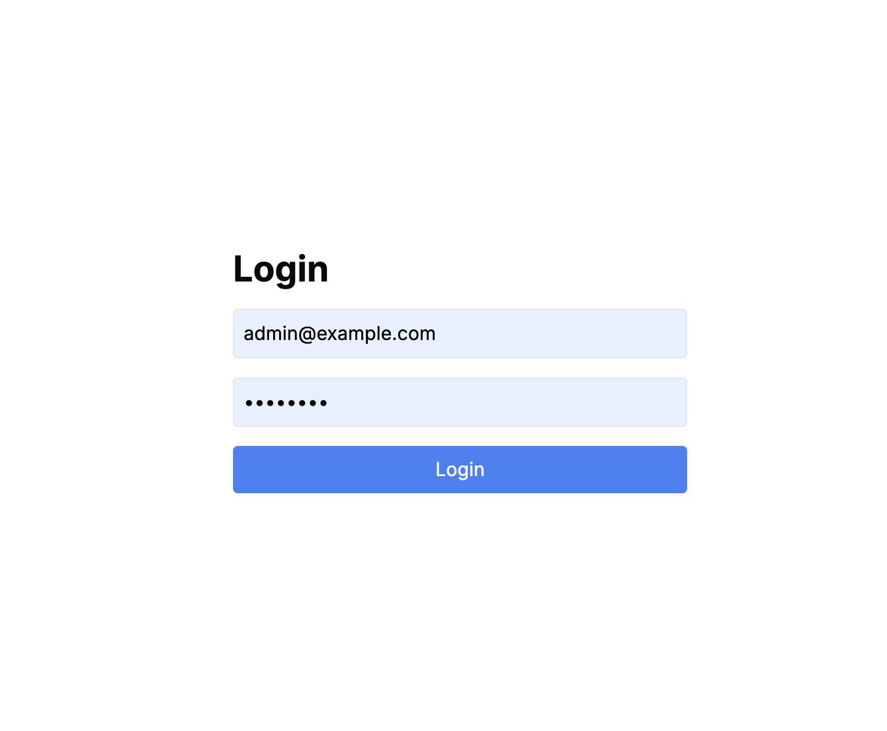
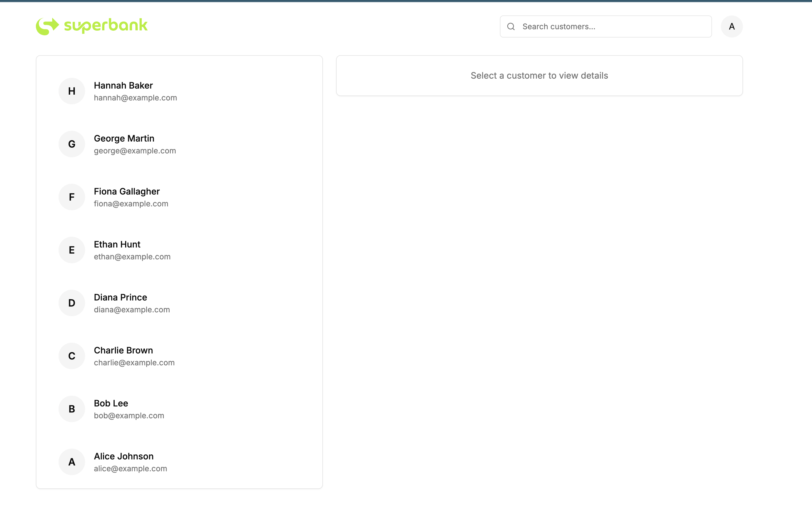
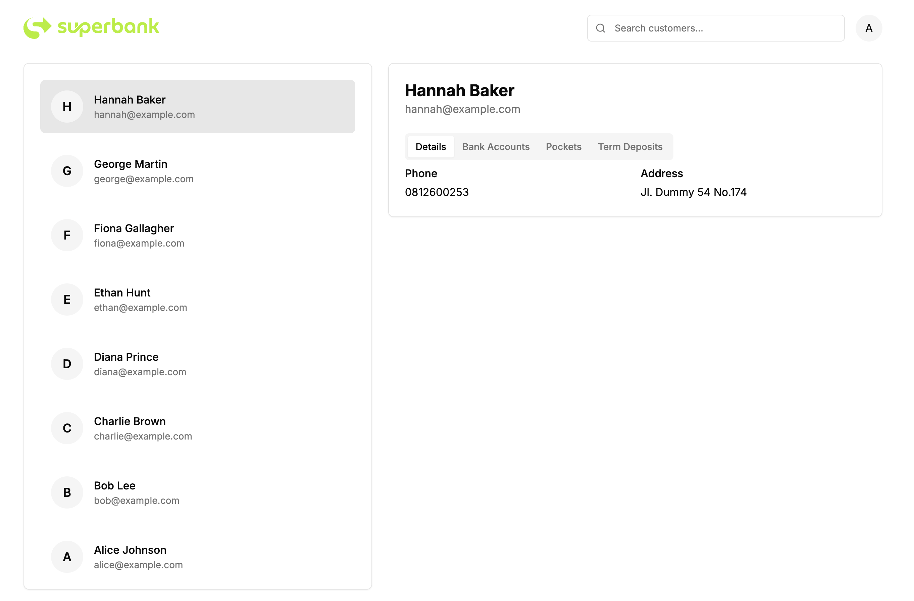
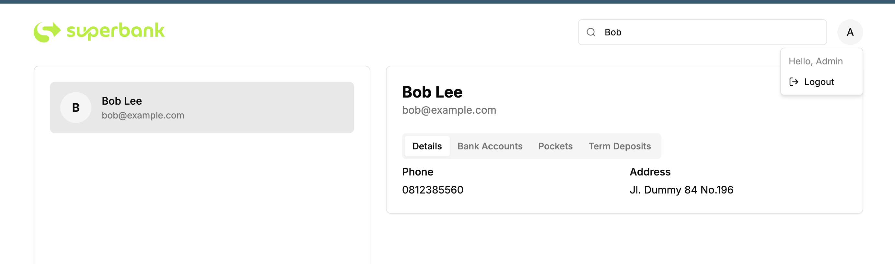

# Superbank Test

Panduan untuk menjalankan aplikasi Superbank Test.

## Cara Akses Aplikasi

### Backend

1. **Masuk ke folder backend**
   ```bash
   cd backend
   ```

2. **Ubah file `.env` sesuai dengan konfigurasi yang diperlukan**  
   Pastikan settingan di file `.env` sesuai dengan database dan pengaturan lainnya.

3. **Buat database sesuai dengan konfigurasi di file `.env`**

4. **Jalankan perintah berikut untuk memastikan semua dependensi tersedia**  
   ```bash
   go mod sum
   ```

5. **Jalankan aplikasi backend**  
   ```bash
   go run main.go
   ```

6. **Migrasi database akan berjalan otomatis** dan beberapa data dummy akan di-insert secara otomatis.

---

### Frontend

1. **Masuk ke folder frontend**  
   ```bash
   cd frontend/src
   ```

2. **Instal dependensi frontend**  
   ```bash
   npm install
   ```

3. **Jalankan aplikasi frontend**  
   ```bash
   npm run dev
   ```

Aplikasi frontend dapat diakses melalui:  
[http://localhost:8080](http://localhost:8080)

---

### Docker (Opsional)

Jika Anda ingin menjalankan aplikasi dengan Docker, ikuti langkah-langkah berikut:

1. **Build Docker image**  
   Di folder root proyek, jalankan perintah berikut untuk membuat image Docker:
   ```bash
   docker-compose up --build
   ```

Aplikasi frontend dan backend akan berjalan di container Docker. Pastikan untuk memeriksa file `docker-compose.yml` dan konfigurasi lainnya jika diperlukan.

---

### Akun Admin

Untuk mengakses aplikasi sebagai admin, gunakan kredensial berikut:

- **Email:** `admin@example.com`
- **Password:** `admin123`

---

### Screenshot Aplikasi

Login Page



Dashboard Page



Detail Customer



Logout View Page


